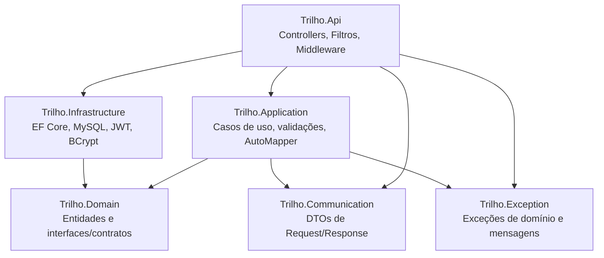

# Trilho.Api

API REST em **.NET 8** para cadastro de usuários e autenticação, construída como exemplo prático de **Clean Architecture**, princípios **SOLID** e **Injeção de Dependência**. Faz CRUD completo de usuário, hashing de senha com BCrypt e emissão de token **JWT** no login.

> Projeto de portfólio: o objetivo é demonstrar organização em camadas, separação de responsabilidades e boas práticas de uma Web API em C#, não é um produto em produção.

## Sumário

- [Sobre o projeto](#sobre-o-projeto)
- [Arquitetura](#arquitetura)
- [Tecnologias](#tecnologias)
- [Estrutura de pastas](#estrutura-de-pastas)
- [Endpoints](#endpoints)
- [Regras de validação](#regras-de-validação)
- [Segurança](#segurança)
- [Como executar](#como-executar)
- [Configuração](#configuração)
- [Possíveis evoluções](#possíveis-evoluções)

## Sobre o projeto

A API expõe operações de CRUD sobre a entidade `User` (nome, e-mail, senha e papel/role) e um endpoint de login que valida as credenciais e devolve um JWT assinado. Toda a lógica de negócio fica isolada da camada web e da camada de persistência, seguindo Clean Architecture: as regras de domínio não conhecem detalhes de infraestrutura (banco, criptografia, geração de token), apenas contratos (`interfaces`) que a Infraestrutura implementa — isso é o que viabiliza a Inversão de Dependência (o "D" do SOLID) e torna o projeto fácil de testar e de trocar peças (por exemplo, trocar MySQL por outro banco sem tocar em Domain/Application).

## Arquitetura

Solução dividida em 6 projetos, cada um com uma responsabilidade única:



- **Trilho.Domain** — núcleo da aplicação: entidade `User`, enum `Roles` e as *interfaces* (`IUserReadOnlyRepository`, `IUserWriteOnlyRepository`, `IUserUpdateOnlyRepository`, `IUnitOfWork`, `IPasswordEncripter`, `IAcessTokenGenerator`) que as demais camadas implementam. Não depende de nenhum outro projeto da solução.
- **Trilho.Application** — casos de uso (`CreateUserUseCase`, `LoginUseCase`, `UpdateUserUseCase`, `DeleteUserUseCase`, `GetAllUserUseCase`, `GetByIdUserUseCase`), validações com FluentValidation e mapeamento de objetos com AutoMapper. Orquestra o Domain, mas não sabe como os dados são persistidos.
- **Trilho.Infrastructure** — implementações concretas: `TrilhoDbContext` (EF Core + Pomelo MySQL), `UserRepository`, `UnitOfWork`, `JwtTokenGenerator` e `BCrypt` (hash de senha). É a única camada que conhece detalhes técnicos de banco/criptografia/token.
- **Trilho.Communication** — contratos de entrada e saída da API (`RequestUserJson`, `ResponseUserJson`, `ResponseErrorJson`, etc.), desacoplando o formato HTTP das entidades de domínio.
- **Trilho.Exception** — hierarquia de exceções de domínio (`TrilhoException` → `ErrorOnValidationException`, `NotFoundException`, `InvalidLoginException`) e as mensagens de erro localizáveis (`ResourceErrorsMessage`).
- **Trilho.Api** — camada de apresentação: `UserController`, filtro global de exceções (`ExceptionFilter`, que traduz cada exceção de domínio no status HTTP correspondente) e middleware de cultura (`CultureMiddleware`, seleciona idioma das mensagens de erro pelo header `Accept-Language`).

Toda dependência aponta para dentro (em direção ao Domain) — Domain não referencia nenhuma outra camada, e a Api é o único ponto de composição que conhece todos os projetos (via injeção de dependência configurada em `Program.cs`, `AddApplication()` e `AddInfrasctructure()`).

## Tecnologias

- [.NET 8](https://dotnet.microsoft.com/) / ASP.NET Core Web API
- [Entity Framework Core 8](https://learn.microsoft.com/ef/core/) + [Pomelo.EntityFrameworkCore.MySql](https://github.com/PomeloFoundation/Pomelo.EntityFrameworkCore.MySql) (MySQL)
- [FluentValidation](https://docs.fluentvalidation.net/) — validação das requisições
- [AutoMapper](https://automapper.org/) — mapeamento entre DTOs e entidades
- [BCrypt.Net-Next](https://github.com/BcryptNet/bcrypt.net) — hash de senha
- [System.IdentityModel.Tokens.Jwt](https://learn.microsoft.com/dotnet/api/system.identitymodel.tokens.jwt) — geração de token JWT
- [Swashbuckle (Swagger/OpenAPI)](https://github.com/domaindrivendev/Swashbuckle.AspNetCore) — documentação/teste interativo dos endpoints

## Estrutura de pastas

```
Trilho.sln
src/
├── Trilho.Api/              # Controllers, Filters, Middleware, Program.cs, appsettings
├── Trilho.Application/      # UseCases/, AutoMapper/, DI da camada de aplicação
├── Trilho.Communication/    # Requests/, Responses/ (DTOs)
├── Trilho.Domain/           # Entities/, Enum/, Repositories/ (interfaces), Security/ (interfaces)
├── Trilho.Exception/        # ExceptionBase/, mensagens de erro (.resx)
└── Trilho.Infrastructure/   # DataAcess/ (EF Core, repositórios), Migrations/, Security/ (JWT, BCrypt)
```

## Endpoints

Controller base: `api/User` (`UserController`).

| Método | Rota            | Descrição                          | Sucesso | Possíveis erros            |
|--------|-----------------|-------------------------------------|---------|-----------------------------|
| POST   | `/api/User`     | Cria um usuário                     | 201     | 400 (validação)             |
| GET    | `/api/User`     | Lista todos os usuários             | 200 / 204 | —                          |
| GET    | `/api/User/{id}`| Busca um usuário por id             | 200     | 404 (não encontrado)        |
| PUT    | `/api/User/{id}`| Atualiza um usuário                 | 204     | 400 (validação) / 404       |
| DELETE | `/api/User/{id}`| Remove um usuário                   | 204     | 404 (não encontrado)        |
| POST   | `/api/login`    | Autentica e retorna um token JWT    | 200     | 401 (credenciais inválidas) |

Todas as respostas de erro seguem o formato:
```json
{
  "errorMessages": ["mensagem do erro"]
}
```

### Exemplo — criar usuário
`POST /api/User`
```json
{
  "name": "Vitor",
  "email": "vitor@email.com",
  "password": "Senha123!",
  "role": "user"
}
```
Resposta `201 Created`:
```json
{
  "id": 1,
  "email": "vitor@email.com",
  "name": "Vitor",
  "role": "user"
}
```

### Exemplo — login
`POST /login`
```json
{
  "email": "vitor@email.com",
  "password": "Senha123!"
}
```
Resposta `200 OK`:
```json
{
  "name": "Vitor",
  "token": "eyJhbGciOiJIUzI1NiIsInR5cCI6IkpXVCJ9..."
}
```

## Regras de validação

Aplicadas via FluentValidation (`CreateUserValidator` / `UpdateUserValidator`):

- **Nome** e **Role**: obrigatórios.
- **E-mail**: obrigatório e precisa ser um e-mail válido; não pode já estar cadastrado (checado contra o banco na criação).
- **Senha** (`PasswordValidator`): mínimo de 8 caracteres, com pelo menos 1 letra maiúscula, 1 minúscula, 1 número e 1 caractere especial (`! ? * . & $ # @`).

As mensagens de validação vêm de um arquivo de recursos (`ResourceErrorsMessage.resx`) e são resolvidas conforme o header `Accept-Language` da requisição (via `CultureMiddleware`).

## Segurança

- **Senhas** nunca são armazenadas em texto puro: são hasheadas com **BCrypt** (`IPasswordEncripter`) antes de persistir e verificadas com `BCrypt.Verify` no login.
- **Login** gera um **JWT** assinado (HMAC-SHA256) contendo o nome e o id do usuário como claims, com tempo de expiração configurável (`Settings:Jwt:ExpiresMinutes`).
- ⚠️ **Nota**: atualmente o token é emitido no login, mas a validação do JWT (middleware de autenticação/`[Authorize]`) ainda não está conectada aos demais endpoints — ou seja, o token é gerado, mas as rotas de CRUD não exigem Bearer token ainda. Isso está listado em [Possíveis evoluções](#possíveis-evoluções).

## Como executar

### Pré-requisitos
- [.NET 8 SDK](https://dotnet.microsoft.com/download/dotnet/8.0)
- MySQL Server (local ou em container) acessível

### Passos
1. Clone o repositório e restaure as dependências:
   ```bash
   git clone <url-do-seu-repositorio>
   cd Trilho
   dotnet restore Trilho.sln
   ```
2. Configure a connection string em `src/Trilho.Api/appsettings.json` (`ConnectionStrings:Connection`) apontando para o seu MySQL, e ajuste `Settings:Jwt:SigningKey`.
   > Por segurança, prefira não versionar credenciais reais: use [User Secrets](https://learn.microsoft.com/aspnet/core/security/app-secrets) (`dotnet user-secrets`) ou variáveis de ambiente em vez de editar o `appsettings.json` diretamente.
3. Rode a aplicação:
   ```bash
   dotnet run --project src/Trilho.Api
   ```
   As *migrations* do EF Core são aplicadas automaticamente na inicialização (`DataBaseMigration.MigrateDatabase`, chamado em `Program.cs`) — não é necessário rodar `dotnet ef database update` manualmente.
4. Acesse o Swagger em `https://localhost:7242/swagger` (ou `http://localhost:5018/swagger`) para testar os endpoints interativamente.

## Configuração

Chaves relevantes em `appsettings.json`:

| Chave                              | Descrição                                         |
|-------------------------------------|----------------------------------------------------|
| `ConnectionStrings:Connection`      | Connection string do MySQL                          |
| `Settings:Jwt:SigningKey`           | Chave usada para assinar o JWT                       |
| `Settings:Jwt:ExpiresMinutes`       | Tempo de expiração do token, em minutos              |

## Possíveis evoluções

Ideias para quem quiser evoluir o projeto a partir daqui:
- Conectar o JWT gerado no login à autenticação/autorização dos demais endpoints (`AddAuthentication().AddJwtBearer(...)` + `[Authorize]`).
- Adicionar um projeto de testes automatizados (a solução já reserva uma pasta lógica `tests` no `.sln`, mas ainda não há projeto de teste).
- Mover segredos (senha do banco, signing key do JWT) para User Secrets/variáveis de ambiente.
- Paginação na listagem de usuários (`GET /api/User`).

---

Projeto pessoal desenvolvido para fins de estudo/portfólio.
